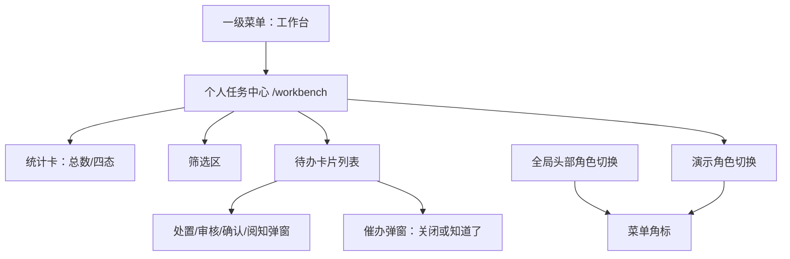
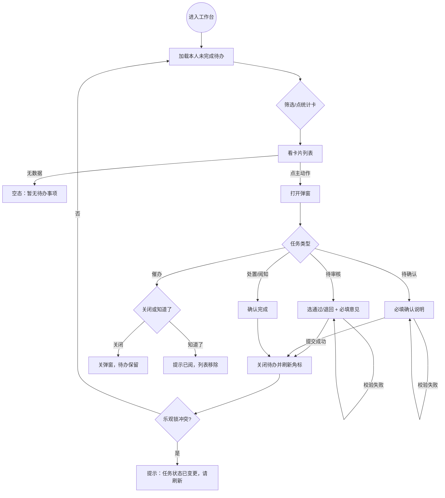

# 工作台（个人任务中心）PRD（完整稿）

**版本**：V1.5（MVP，对齐现网）  
**模块**：工作台  
**最后更新**：2026-08-19  
**适用项目**：`project_qingpu_pc`  
**对照文档**：企业模版结构见同目录 `prd.md`；清单见 `待办事项清单.md`

---

## 1. 背景与目标

### 1.1 背景

节点审核、谋划/退库/增补、领导交办、难题协调、预警信息、催办等待办分散在各业务模块，用户需跨菜单查找，事项优先级与「现在该做什么」不清晰。工作台作为个人任务入口，按人聚合未完成事项并在页内闭环处理。

### 1.2 目标（MVP）

1. 左侧菜单最后一级「工作台」，路由 `/workbench`，页面标题「个人任务中心」（无副标题）。
2. 按当前登录人聚合未完成待办；统一四态：待处置 / 待审核 / 待确认 / 待查阅。
3. 卡片同时展示业务状态与应做动作；预警信息在动作后再展示类型标签。
4. 页内弹窗完成处理；菜单角标 = 未完成待办数（含催办提示）。
5. 来源展示 9 类：项目节点审核、谋划库、退库、增补库、领导交办、难题协调、预警信息、协调催办、交办催办。
6. 演示支持角色切换；系统管理员看全部未完成（来源模块 × 业务状态去重）。

### 1.3 非目标（本期不做）

- 批量处理、导出待办
- 外部消息通道 / 催办策略引擎全量对接
- 跳转来源业务页深度联调（仅弹窗闭环）
- 部门/单位任务池、代办他人
- 上级资金填报、形象进度填报进工作台
- 卡片展示「处理人」
- 生产环境角色切换器

---

## 2. 术语与定义

| 术语 | 定义 |
|---|---|
| 待办任务 | 指派给某用户、需其在工作台处理的一条记录 |
| 来源业务 | 产生待办的业务类型；卡片展示名，筛选同名合并 |
| 预警信息 | 红黄灯（销号/处置）与监测响应（阅知）的统一来源展示名 |
| 预警类型标签 | 动作标签后的补充标签（红灯/黄灯/监测响应 + 事项名） |
| 业务状态 | 来源模块原文状态（如「分管领导待初审」「未销号」） |
| 应做动作 | 当前用户在本条待办上要做的动作 |
| 工作台四态 | 待处置 / 待审核 / 待确认 / 待查阅 |
| 催办提示 | 一般性催办卡片，不替代业务处置待办 |
| 处置节点 | 项目节点审核对应的节点名称 |

---

## 3. 用户与使用场景

### 3.1 角色

| 角色 | 说明 | 本模块操作 |
|---|---|---|
| 项目专员 | 填报、修改、处置、确认、预警办理 | 见 §6.5 主表 |
| 分管领导 | 初审、难题协调审核 | 初审/审核、查看催办 |
| 片区专员 | 终审、节点审核、交办审核、协调查阅 | 审核/终审/查阅 |
| 市领导 | 交办完结查阅 | 查阅、交办催办 |
| 部门一把手 | 上级协调事项审核 | 去审核 |
| 投管科 | 数据管理维护 | 可进工作台，本期无待办 |
| 系统管理员 | 演示全量视图 | 看全部未完成（去重） |

### 3.2 典型场景

1. **专员改退回**：进入工作台 → 见「退库申请退回待改：…」→ 去修改 → 弹窗确认 → 待办关闭。
2. **分管初审**：见「谋划库待初审」→ 去初审 → 填意见通过/退回。
3. **预警销号**：见来源「预警信息」、标签「红灯-超期未农转用批复」→ 去销号/处置。
4. **预警阅知**：见「预警信息未阅」与「监测响应-…」标签 → 去阅知。
5. **催办已阅**：点查看处置 → 关闭则待办仍在 → 知道了才从列表消失，业务处置待办仍在。
6. **管理员抽查**：切系统管理员 → 全量未完成、同模块同状态只留一条。

---

## 4. 信息架构与页面

### 4.0 IA 图（信息架构）

### 4.1 用户流程图（User Flow）

### 4.2 页面清单

| ID | 页面 | 路由 | 用途 |
|---|---|---|---|
| P1 | 个人任务中心 | `/workbench` | 统计、筛选、卡片列表、演示角色切换 |
| P2 | 任务处置弹窗 | 页内 Modal | 审核/确认/处置/阅知 |
| P3 | 催办说明弹窗 | 同一 Modal | 查看催办事项组；关闭 / 知道了 |

无独立详情页、无新建页。

### 4.3 页面布局要点（可交付研发）

**P1**

- 顶栏：左「个人任务中心」；右「当前：姓名（角色）」+ 下拉（不含投管科）。
- 统计 5 卡可点：待办总数 / 待处置 / 待审核 / 待确认 / 待查阅。
- 筛选：关键词、来源业务、状态、接收时间、逾期；查询 / 重置。
- 卡片：标题 → 来源 + 业务状态 Tag +「动作：xxx」Tag +（可选）预警类型 Tag +（可选）「节点：xxx」+ 项目名编码 → 摘要 → 催办摘要 → 右主按钮 → 底接收时间 /（条件）截止时间。
- 无处理人 Tag、无副标题。
- 分页：超过 pageSize 显示分页。

**P2 / P3**

- 标题：`{来源展示名} · {任务标题}`。
- 只读描述：来源、业务状态、应做动作、预警类型（若有）、工作台状态、关联项目或催办事项组、处置节点（若有）、时间、摘要、催办信息。
- 催办底部文案：关闭仅关弹窗；知道了才已阅。

---

## 5. 数据模型（字段定义）

### 5.1 核心实体：WorkbenchTask

| 字段 | 类型 | 必填 | 说明 |
|---|---|---|---|
| id | string | 是 | 待办 ID |
| assigneeId | string | 是 | 处理人用户 ID |
| bizStatus | string | 是 | 业务状态原文 |
| actionCode | enum | 是 | 见 §5.3 |
| actionLabel | string | 是 | 按钮文案 |
| title | string | 是 | 卡片标题 |
| projectName / projectCode | string | 否 | 关联项目 |
| nodeName | string | 条件 | 节点审核 |
| subtypeTag | string | 条件 | 预警类型标签 |
| relatedMatter | string | 否 | 非催办组时的关联事项 |
| sourceModule | enum | 是 | 见 §5.2 |
| sourceBizId | string | 是 | 来源业务单据 ID |
| status | enum | 是 | 工作台四态或 done |
| tags | string[] | 是 | 内部标签；卡片不直接渲染该数组 |
| urgeMeta | object | 条件 | 催办 |
| receivedAt | datetime | 是 | 接收时间 |
| dueAt | datetime | 条件 | 仅交办、难题协调参与展示与逾期 |
| isOverdue | boolean | 算 | dueAt 早于当前 |
| summary | string | 否 | 提示性摘要 |
| updatedAt | datetime | 是 | 乐观锁 |

### 5.2 来源业务

| sourceModule | 展示名 | 备注 |
|---|---|---|
| node-audit | 项目节点审核 | |
| planning-pool | 谋划库 | |
| delist | 退库 | |
| supplement-library | 增补库 | |
| leader-assign | 领导交办 | 展示截止时间 |
| problem-coord | 难题协调 | 展示截止时间 |
| alert-management | 预警信息 | 红黄灯 |
| monitor-response | 预警信息 | 监测响应 |
| urge-coord | 协调催办 | |
| urge-assign | 交办催办 | |

筛选按展示名去重；选「预警信息」同时命中后两码。

### 5.3 动作编码

| actionCode | 按钮 |
|---|---|
| report | 去填报 |
| modify | 去修改 |
| first_audit | 去初审 |
| final_audit | 去终审 |
| dispose | 去处置 |
| audit / superior_audit | 去审核 |
| confirm | 去确认 |
| read | 去查阅 |
| acknowledge | 去阅知 |
| alert_close | 去销号/处置 |
| urge_view | 查看处置 |

### 5.4 附属：催办

| 字段 | 说明 |
|---|---|
| urgeCount | 条数 |
| urgerName | 催办人 |
| urgedAt | 催办时间 |
| relatedItems[].matter | 关联事项 |
| relatedItems[].projectName / projectCode | 关联项目 |

---

## 6. 核心功能需求

### 6.1 列表/卡片展示字段

见 §4.3。预警类型标签颜色：红灯 red、黄灯 gold、监测响应 purple。

现网预警示例：

| 业务状态 | 类型标签 | 标题后缀 |
|---|---|---|
| 未销号 | 红灯-超期未农转用批复 | 超出计划完成时间未完成农转用批复，计划完成时间：2026-01-01。 |
| 已销号未处置 | 黄灯-超期未农转用批复 | 同上 |
| 未阅 | 监测响应-超期未征地二公告预警抄送 | 同上 |

### 6.2 创建/编辑/复制/删除

工作台不创建业务单据。处理成功将本条 `status` 置 `done`（mock）。无删除、无复制。

### 6.3 搜索/筛选/排序

| 条件 | 规则 |
|---|---|
| 关键词 | 标题、项目名、编码、摘要，模糊、不区分大小写 |
| 来源 | 按展示名匹配（预警信息含两类） |
| 状态 | 工作台四态 |
| 接收时间 | 按日期闭区间 |
| 逾期 | 全部 / 仅逾期 / 仅未逾期（仅对有截止时间的卡有意义） |
| 排序 | 逾期优先 → dueAt 升序（无 dueAt 排后） |
| 重置 | 清空全部条件 |

### 6.4 导入/导出

本期不做。

### 6.5 进台主表（角色 × 模块 × 状态·动作）

| 模块 | 项目专员 | 分管领导 | 片区专员 | 市领导 | 部门一把手 |
|---|---|---|---|---|---|
| 项目节点审核 | 审核退回（填报） | | 待审核（审核） | | |
| 谋划库 | 退回（修改） | 分管领导待初审（初审） | 片区专员待审核（终审） | | |
| 退库 | 退回（修改） | 分管领导待初审（初审） | 片区专员待审核（终审） | | |
| 增补库 | 退回（修改） | 分管领导待初审（初审） | 片区专员待审核（终审） | | |
| 领导交办 | 待处理/处理中（处置） | | 待审核（审核） | 已完结待查阅（查阅） | |
| 难题协调 | 待处理/处理中（处置）；待完结（确认）；退回（修改） | 待审核/待确认（审核） | 审核中（审核）；已完结待查阅（查阅） | | 待处理/处理中（审核上级协调） |
| 预警信息 | 未销号（销号/处置）；已销号未处置（处置）；未阅（阅知） | | | | |
| 协调催办 | 催办提示（查看处置） | 催办提示 | 催办提示 | | 催办提示 |
| 交办催办 | 催办提示 | | 催办提示 | 催办提示 | |

不进台：节点待填报；谋划/退库/增补首次申报（未退回）；上级资金/形象进度；终态已入库/已退库/已撤销/已处置/已阅/审核通过等。

### 6.6 标题与摘要口径

| 类型 | 标题 | 摘要示例 |
|---|---|---|
| 退回 | `模块退回待改：{原因}` | 退库/增补：「审核退回，请修改后重新申报。」 |
| 待初审/待终审 | 无冒号后缀 | 「专员已提交…请初审/终审。」 |
| 交办/协调非退回 | `状态：{事项内容}` | 「交办已下达，请尽快处置并反馈。」 |
| 预警 | `预警信息{状态}：超出计划完成时间未完成农转用批复，计划完成时间：2026-01-01。` | 未销号：「预警尚未销号，请及时办理销号或处置。」已销号未处置：「预警已销号但尚未处置，请及时进行处置。」未阅：「预警信息尚未阅知，请及时查阅当前页面并办理阅知。」 |

---

## 7. 状态机（表格）

### 7.1 状态枚举（工作台）

| 状态码 | 展示 | 含义 |
|---|---|---|
| pending_dispose | 待处置 | 填报/修改/处置/销号 |
| pending_review | 待审核 | 初审/终审/审核 |
| pending_confirm | 待确认 | 专员确认完结 |
| pending_read | 待查阅 | 查阅、阅知、催办提示 |
| done | 已完成 | 不进列表与角标 |

### 7.2 状态转移与动作规则

| 当前状态 | 动作 | 目标状态 | 前置条件 | 失败分支 | 失败提示 | 幂等/回滚 |
|---|---|---|---|---|---|---|
| pending_review | 提交审核 | done | 意见非空；expectedUpdatedAt 匹配 | 意见空 | 请填写审核意见 | 不改状态 |
| pending_review | 提交审核 | done | 同上 | 时间戳不匹配 | 任务状态已变更，请刷新 | 不改状态 |
| pending_confirm | 提交确认 | done | 说明非空；时间戳匹配 | 说明空 | 请填写确认说明 | 不改状态 |
| pending_dispose | 确认处置 | done | 时间戳匹配 | 冲突 | 任务状态已变更，请刷新 | 不改状态 |
| pending_read（查阅/阅知） | 确认已阅 | done | 时间戳匹配 | 冲突 | 同上 | 不改状态 |
| pending_read（催办） | 关闭 | 不变 | — | — | — | 仅关弹窗 |
| pending_read（催办） | 知道了 | done | 时间戳匹配 | 冲突 | 任务状态已变更，请刷新 | 不关闭业务处置待办 |
| 任意未完成 | 列表加载 | — | 普通角色 assigneeId；管理员全量去重 | — | — | — |

业务下一岗待办由各模块流程生成（本期 mock 不自动派下一岗）。查阅/阅知不可退回重开。

---

## 8. 权限与安全

### 8.1 权限点（最小集）

| 权限点 | 规则 |
|---|---|
| workbench:enter | 登录角色均可进（含投管科） |
| workbench:list:self | 非管理员仅本人 |
| workbench:list:all | 仅系统管理员 |
| workbench:process | 仅当前处理人；生产需后端校验 |
| workbench:urge:ack | 仅本人相关催办 |

### 8.2 风险操作策略

| 操作 | 策略 |
|---|---|
| 审核退回 | 意见必填；无二次确认弹窗（MVP） |
| 催办已阅 | 关闭与知道了分离，防误消 |
| 并发 | updatedAt 乐观锁 |
| 审计 | 本期 mock 无操作日志；生产建议记处理人/结论/时间 |
| 回滚 | 处理成功不在工作台撤销 |

---

## 9. 异常与边界（必须覆盖）

### 9.1 空态

列表或筛选无结果：`暂无待办事项`。投管科进入即为空态。

### 9.2 加载态

列表 Spin；提交按钮 loading，防重复提交。

### 9.3 错误态

| 场景 | 处理 |
|---|---|
| 待办不存在 | 「待办不存在」 |
| 乐观锁失败 | 「任务状态已变更，请刷新」 |
| 审核/确认缺项 | 对应必填 toast |
| 网络/5xx | 「处理失败」（生产应对齐网关文案） |

无独立 401 页；未登录按项目统一登录（本期演示无真实登录）。

### 9.4 长文本/多标签/大量数据/并发点击

- 标题/摘要折行。
- 预警可同时出现业务状态、动作、类型标签、项目名。
- 列表客户端分页。
- 提交中锁定确定按钮。
- 催办与业务待办并存，不合并。

---

## 10. 埋点与指标（可选）

本期不做。建议后续：工作台曝光、各动作点击、催办知道了/关闭比、处理耗时、逾期占比。

---

## 11. 验收标准（DoD）

### 11.1 功能 DoD

- P1～P3 可用；角标与列表同口径。
- §6.5 各角色仅见对应待办，按钮与四态一致。
- 预警信息来源名、筛选合并、类型标签、三条标题/摘要与现网一致。
- 节点待填报不进台；处置节点展示。
- 截止时间仅交办/难题协调；逾期仅对这些卡。
- 催办：关闭保留、知道了已阅、事项成组。
- 资金/形象进度不进台。

### 11.2 质量 DoD

- 空/加载/错误可用。
- 审核意见、确认说明必填。
- 并发有提示。
- 无处理人标签、无页副标题。

---

## 12. 验收用例清单（测试可直接用）

### 12.1 列表与展示

| 编号 | 步骤 | 期望 |
|---|---|---|
| L-S | 专员进入 /workbench | 仅本人未完成；有统计与卡片 |
| L-T | 看预警未销号卡 | 来源「预警信息」；动作后「红灯-超期未农转用批复」；标题含农转用批复与 2026-01-01 |
| L-Y | 看已销号未处置 | 黄灯标签；标题同上结构 |
| L-M | 看未阅 | 监测响应类型标签；标题同上结构；按钮「去阅知」 |
| L-N | 看节点待审核 | 「节点：施工许可证」；无「取得」 |
| L-P | 卡片上找处理人 | 无此标签 |
| L-D | 谋划库待初审卡 | 截止时间不展示 |

### 12.2 搜索

| 编号 | 步骤 | 期望 |
|---|---|---|
| S-S | 关键词输入项目编码 | 命中该卡 |
| S-F | 无匹配词 | 空态 |

### 12.3 筛选与排序

| 编号 | 步骤 | 期望 |
|---|---|---|
| F-A | 来源选预警信息 | 未销号、已销号未处置、未阅均在 |
| F-ST | 点统计「待查阅」 | 状态筛选为待查阅 |
| F-R | 重置 | 条件清空 |
| F-O | 仅逾期 | 只出有截止且逾期的交办/协调卡 |

### 12.4 新建/编辑

| 编号 | 步骤 | 期望 |
|---|---|---|
| E-N | 寻找新建待办 | 无入口 |
| E-R | 待审核不填意见点确定 | 「请填写审核意见」，状态不变 |
| E-C | 待确认不填说明 | 「请填写确认说明」 |
| E-S | 处置确认成功 | 列表与角标减少 |

### 12.5 催办

| 编号 | 步骤 | 期望 |
|---|---|---|
| U-O | 打开催办弹窗 | 事项与项目成组 |
| U-X | 点关闭 | 弹窗关，卡片仍在 |
| U-K | 点知道了 | 催办卡消失，对应业务处置卡仍在 |

### 12.6 权限矩阵

| 编号 | 步骤 | 期望 |
|---|---|---|
| P-SP | 专员 | 见退回/处置/预警/本人催办 |
| P-SU | 分管 | 见待初审等，不见专员预警销号 |
| P-AD | 管理员 | 全量去重 |
| P-IM | 头部切投管科再进工作台 | 空列表，角标 0 |

### 12.7 错误与恢复

| 编号 | 步骤 | 期望 |
|---|---|---|
| R-L | 提交时 updatedAt 已变 | 「任务状态已变更，请刷新」 |
| R-D | 连续点击确定 | 只成功一次 |

### 12.8 边界

| 编号 | 步骤 | 期望 |
|---|---|---|
| B-L | 超长标题 | 折行不遮按钮 |
| B-U | 催办+处置同屏 | 两条都在 |

---

## 13. 决策点（需要拍板 + 默认建议）

| 编号 | 问题 | 已确认 / 推荐默认 | 影响 |
|---|---|---|---|
| D1 | 分管状态文案 | ✅ 分管领导待初审 | 与「待审核」区分 |
| D3 | 待确认 vs 待完结 | ✅ 卡片标明动作 | 审核/确认不混 |
| C1 | 催办是否进角标 | ✅ 计入待查阅 | |
| A1 | 首次申报是否进台 | ✅ 不进，仅退回 | |
| N1 | 节点待填报 | ✅ 不进台 | |
| T1 | 标题后缀 | ✅ 退回跟原因；初审终审无后缀；交办协调跟事项 | |
| U1 | 催办弹窗 | ✅ 查看处置；成组；关闭≠已阅 | |
| M1 | 管理员 | ✅ 全部 + 模块×状态去重 | 演示去重键非业务单号 |
| F1 | 资金/进度 | ✅ 不进工作台 | |
| W1 | 红黄灯与监测响应名称 | ✅ 统一「预警信息」 | 筛选合并 |
| W2 | 预警类型标签 | ✅ 动作后红灯/黄灯/监测响应 | |
| W3 | 预警标题 | ✅ 农转用批复 + 计划完成时间 2026-01-01 | 演示文案 |
| W4 | 摘要风格 | ✅ 提示办理，不写「模块：状态（动作）【路径】」 | |
| I1 | 投管科工作台 | ✅ 可进、无待办 | 不在工作台页切换器 |
| — | 删除待办 | 推荐：不做用户删除，处理即 done | |
| — | 处理是否跳业务页 | ✅ MVP 弹窗闭环 | |

---

## 需求匹配度自检

**覆盖度检查**（对照现网实现与近期口径）

| 需求点 | 位置 | 状态 |
|---|---|---|
| 个人任务中心、四态、角标 | §1 / §4 / §6 | ✅ |
| 9 类来源展示、预警信息合并 | §5.2 / §6.5 | ✅ |
| 角色主表与不进台规则 | §6.5 | ✅ |
| 类型标签、预警标题/摘要 | §6.1 / §6.6 | ✅ |
| 催办关闭/知道了 | §7.2 / §12.5 | ✅ |
| 节点名称、无处理人、无副标题 | §4.3 / §12.1 | ✅ |
| 投管科 | §3.1 / §12.6 | ✅ |

**逻辑一致性**

- 工作台状态机无死状态；催办关闭不转移，知道了才 done。
- 权限点与角色主表对应；投管科可进不可办空列表。
- 页面清单 P1–P3 在 §4.3、§6、§9、§11、§12 均有引用。

**完整性**

- 数据模型字段表：✅
- 状态机表格：✅
- 验收用例（含失败/权限）：✅
- 决策点列表：✅

**结论**：现网口径已写入完整稿；可与企业模版 `prd.md` 对照使用。
