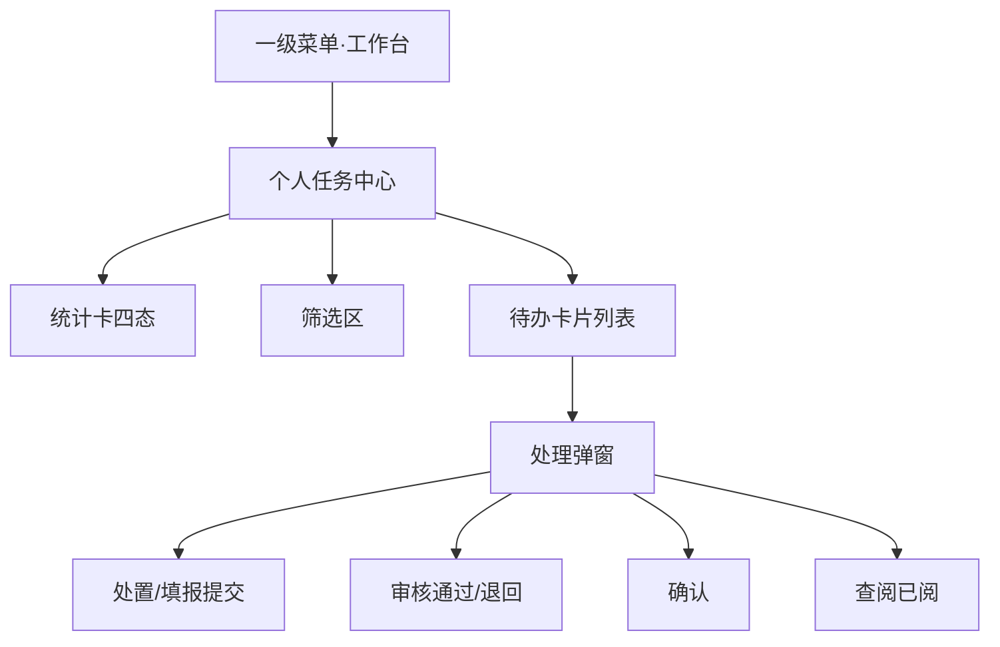
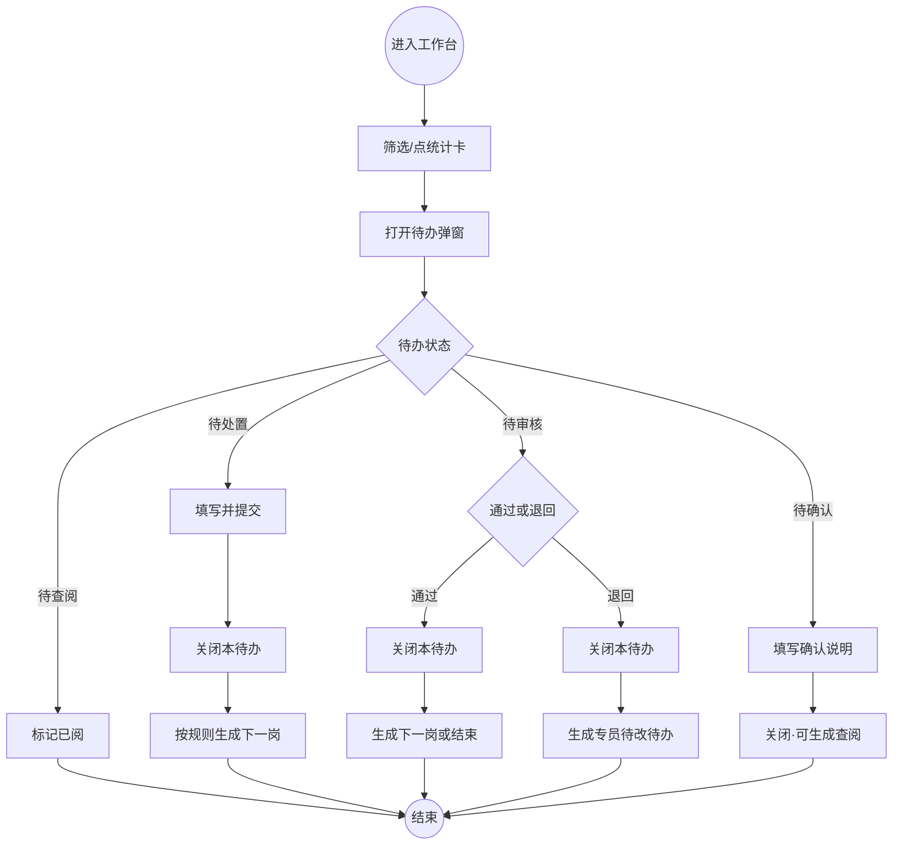

# 工作台 PRD（完整稿）

**版本**：V1.1（MVP）  
**模块**：工作台（个人任务中心）  
**最后更新**：2026-07-31  
**适用项目**：`project_qingpu_pc`  
**变更说明**：对齐业务最新口径——领导交办增加「领导查阅」；难题协调增加「片区专员查阅」；项目进度信息拆分为资金月报 / 进度周报。

---

## 1. 背景与目标

### 1.1 背景

各业务模块（节点审核、谋划/退库/增补、领导交办、难题协调、预警、进度填报）产生的个人待办分散，用户需频繁跨模块查找。工作台作为统一入口，按人聚合待办并闭环处理。

### 1.2 目标（MVP）

1. 左侧菜单最后一级「工作台」，个人视角聚合待办。
2. 统一四态：`待处置 / 待审核 / 待确认 / 待查阅`；按钮一一对应：`去处置 / 去审核 / 去确认 / 去查阅`。
3. 覆盖 8 类业务来源及完整节点流转（含查阅环节）。
4. 工作台内弹窗完成处理（不跳转来源模块）；菜单角标 = 本人未完成待办数。
5. MVP 使用 mock；支持演示用角色切换（项目专员 / 分管领导 / 片区专员 / 领导）。

### 1.3 非目标（本期不做）

- 批量处理、导出、外部消息推送
- 跳转业务详情页深度联调（仅弹窗闭环）
- 部门/单位维度任务池、代办他人
- 真实审批引擎与消息中心对接

---

## 2. 术语与定义

| 术语 | 定义 |
|---|---|
| 待办任务 | 指派给某用户、需其在工作台处理的一条任务记录 |
| 来源业务 | 产生待办的业务类型（8 类，见 §6.5） |
| 流程节点 | 业务链路中的某一岗（如初审、终审、查阅） |
| 待处置 | 专员侧填报/申报/申请/处置类动作 |
| 待审核 | 分管/片区侧初审、终审、结果审核 |
| 待确认 | 专员对已审处置结果的确认销号 |
| 待查阅 | 领导或片区专员对闭环结果的阅知（标记已阅） |
| 资金月报 | 项目进度信息中，资金类信息的月度填报待办 |
| 进度周报 | 项目进度信息中，形象/实施进度的周度填报待办 |

---

## 3. 用户与使用场景

### 3.1 角色

| 角色 | 工作台职责摘要 |
|---|---|
| 项目专员 | 填报/申报/申请、处置、确认；资金月报与进度周报 |
| 分管领导 | 谋划/退库/增补/难题初审；难题处置结果审核 |
| 片区专员 | 节点审核、各类终审、交办审核；难题闭环后查阅 |
| 领导（交办发起人） | 发起交办（可不占待办）；交办闭环后查阅 |
| 系统 | 生成预警、按周期生成资金月报/进度周报 |

### 3.2 典型场景

1. 专员打开工作台，按「待处置」处理节点填报、退回改、预警、周报/月报。
2. 分管领导按「待审核」完成初审/处置审核。
3. 片区专员完成终审；难题销号后出现「待查阅」。
4. 领导在交办审核通过后收到「待查阅」，标记已阅闭环。

---

## 4. 信息架构与页面

### 4.0 IA 图



### 4.1 用户流程图（主路径 + 审核退回）



### 4.2 页面清单

| 页面/组件 | 路由 | 说明 |
|---|---|---|
| 个人任务中心 | `/workbench` | 唯一页面 |
| 任务处理弹窗 | 页内 Modal | 处置/审核/确认/查阅 |

### 4.3 页面布局要点

1. **标题区**：个人任务中心 + 口径说明；演示角色切换。
2. **统计区**：待办总数、待处置、待审核、待确认、待查阅（点击联动状态筛选）。
3. **筛选区**：关键词、来源业务、状态、接收时间、是否逾期。
4. **列表**：卡片展示来源、节点编码/名称、状态、逾期、标题、项目、摘要、时间、主按钮。
5. **弹窗**：只读详情 + 按状态表单（审核含通过/退回；查阅为已阅确认）。

---

## 5. 数据模型（字段定义）

### 5.1 核心实体：WorkbenchTask（待办任务）

| 字段 | 类型 | 必填 | 说明 |
|---|---|---|---|
| id | string | 是 | 待办 ID |
| assigneeId | string | 是 | 处理人用户 ID |
| bizNode | string | 是 | 节点编码，如 `5-3`、`8-1a` |
| bizNodeLabel | string | 是 | 节点名：填报/初审/查阅等 |
| title | string | 是 | 任务标题 |
| projectName | string | 否 | 关联项目名称 |
| projectCode | string | 否 | 关联项目编码 |
| sourceModule | enum | 是 | 见来源枚举 |
| sourceBizId | string | 是 | 来源业务单据 ID |
| progressKind | enum | 否 | 仅进度信息：`fund` 资金月报 / `schedule` 进度周报 |
| status | enum | 是 | `pending_dispose` / `pending_review` / `pending_confirm` / `pending_read` / `done` |
| tags | string[] | 否 | 展示标签 |
| receivedAt | datetime | 是 | 接收时间 |
| dueAt | datetime | 否 | 截止时间 |
| isOverdue | boolean | 算 | 由 dueAt 与当前时间计算 |
| summary | string | 否 | 摘要 |
| actionLabel | string | 是 | 去处置/去审核/去确认/去查阅 |
| updatedAt | datetime | 是 | 乐观锁/并发校验 |

### 5.2 来源业务枚举（sourceModule）

| 值 | 展示名 |
|---|---|
| node-audit | 项目节点审核 |
| planning-pool | 谋划库 |
| delist | 退库 |
| supplement-library | 增补库 |
| leader-assign | 领导交办 |
| problem-coord | 难题协调 |
| alert-management | 预警管理 |
| progress-report | 项目进度信息 |

---

## 6. 核心功能需求

### 6.1 列表/卡片展示

- 展示字段：逾期标记、状态、标签、标题、来源·节点、项目名/编码、摘要、接收/截止时间、主操作按钮。
- 排序建议：逾期优先，其次按截止时间升序，再次按接收时间倒序。

### 6.2 处理弹窗

| 状态 | 弹窗能力 | 提交后 |
|---|---|---|
| 待处置 | 确认处置/填报完成（MVP 可简化表单） | 本待办 done；按流转生成下一岗 |
| 待审核 | 通过/退回 + 意见必填 | 通过→下一岗或结束；退回→专员待改 |
| 待确认 | 确认说明必填 | done；难题协调再生成片区查阅 |
| 待查阅 | 确认已阅 | done，流程结束 |

### 6.3 搜索/筛选/排序

- 关键词：标题、项目名、项目编码、摘要（模糊）
- 来源业务、状态、接收时间范围、是否逾期
- 统计卡点击 = 设置状态筛选

### 6.4 角标

- 菜单角标 = 当前登录人 `status ≠ done` 的待办数
- 处理成功或切换演示角色后刷新

### 6.5 业务待办明细（主表）

> 每一行 = 工作台中的一条待办类型

| 序号 | 来源业务 | 流程节点 | 触发条件 | 处理人 | 待办状态 | 操作 | 处理后结果（建议） |
|---|---|---|---|---|---|---|---|
| 1-1 | 项目节点审核 | 填报 | 到达节点 / 退回待改 | 项目专员 | 待处置 | 去处置 | 关闭；生成 1-2 |
| 1-2 | 项目节点审核 | 审核 | 专员提交填报 | 片区专员 | 待审核 | 去审核 | 通过→结束；退回→1-1 |
| 2-1 | 谋划库 | 申报 | 退回待改（首次主动申报见决策点 A） | 项目专员 | 待处置 | 去处置 | 关闭；生成 2-2 |
| 2-2 | 谋划库 | 初审 | 专员提交申报 | 分管领导 | 待审核 | 去审核 | 通过→2-3；退回→2-1 |
| 2-3 | 谋划库 | 终审 | 初审通过 | 片区专员 | 待审核 | 去审核 | 通过→结束；退回→2-1（见决策点 B） |
| 3-1 | 退库 | 申报 | 退回待改 | 项目专员 | 待处置 | 去处置 | 关闭；生成 3-2 |
| 3-2 | 退库 | 初审 | 专员提交 | 分管领导 | 待审核 | 去审核 | 通过→3-3；退回→3-1 |
| 3-3 | 退库 | 终审 | 初审通过 | 片区专员 | 待审核 | 去审核 | 通过→结束（退库）；退回→3-1 |
| 4-1 | 增补库 | 申报 | 退回待改 | 项目专员 | 待处置 | 去处置 | 关闭；生成 4-2 |
| 4-2 | 增补库 | 初审 | 专员提交 | 分管领导 | 待审核 | 去审核 | 通过→4-3；退回→4-1 |
| 4-3 | 增补库 | 终审 | 初审通过 | 片区专员 | 待审核 | 去审核 | 通过→结束（入库）；退回→4-1 |
| 5-1 | 领导交办 | 处置 | 领导发起交办 | 项目专员 | 待处置 | 去处置 | 关闭；生成 5-2 |
| 5-2 | 领导交办 | 审核 | 专员提交处置 | 片区专员 | 待审核 | 去审核 | 通过→5-3；退回→5-1 |
| 5-3 | 领导交办 | 查阅 | 片区审核通过 | **领导** | **待查阅** | **去查阅** | 已阅→结束 |
| 6-1 | 难题协调 | 申请 | 退回待改 | 项目专员 | 待处置 | 去处置 | 关闭；生成 6-2 |
| 6-2 | 难题协调 | 初审 | 专员提交申请 | 分管领导 | 待审核 | 去审核 | 通过→6-3；退回→6-1 |
| 6-3 | 难题协调 | 终审 | 初审通过 | 片区专员 | 待审核 | 去审核 | 通过→6-4；退回→6-1 |
| 6-4 | 难题协调 | 处置 | 终审通过 | 项目专员 | 待处置 | 去处置 | 关闭；生成 6-5 |
| 6-5 | 难题协调 | 审核 | 专员提交处置 | 分管领导 | 待审核 | 去审核 | 通过→6-6；退回→6-4 |
| 6-6 | 难题协调 | 确认 | 分管审核通过 | 项目专员 | 待确认 | 去确认 | 关闭；生成 6-7 |
| 6-7 | 难题协调 | 查阅 | 专员确认完成 | **片区专员** | **待查阅** | **去查阅** | 已阅→结束 |
| 7-1 | 预警管理 | 处置 | 系统产生预警 | 项目专员 | 待处置 | 去处置 | 处置后结束 |
| 8-1a | 项目进度信息 | 资金填报 | **每月 1 号**生成当月待办 / 待补报 | 项目专员 | 待处置 | 去处置 | 提交后结束；上期未填可与本期并存 |
| 8-1b | 项目进度信息 | 进度填报 | **每周五晚上**生成当周待办 / 待补报 | 项目专员 | 待处置 | 去处置 | 提交后结束；上期未填可与本期并存 |

### 6.6 流程简图

```text
1. 节点审核：专员填报 → 片区审核 → 结束
2/3/4. 谋划/退库/增补：专员申报 → 分管初审 → 片区终审 → 结束
5. 领导交办：领导发起 → 专员处置 → 片区审核 → 领导查阅 → 结束
6. 难题协调：专员申请 → 分管初审 → 片区终审 → 专员处置 → 分管审核 → 专员确认 → 片区查阅 → 结束
7. 预警：系统预警 → 专员处置 → 结束
8. 进度信息：
   - 资金：每月 1 号生成月报待办 → 专员填报 → 结束（各周期可并存）
   - 进度：每周五晚上生成周报待办 → 专员填报 → 结束（各周期可并存）
```

### 6.7 角色职责总表

| 角色 | 待办节点 | 主要动作 |
|---|---|---|
| 项目专员 | 1-1、2-1、3-1、4-1、5-1、6-1、6-4、6-6、7-1、8-1a、8-1b | 填报/申报/处置/确认 |
| 分管领导 | 2-2、3-2、4-2、6-2、6-5 | 初审、处置审核 |
| 片区专员 | 1-2、2-3、3-3、4-3、5-2、6-3、**6-7** | 审核/终审/**查阅** |
| 领导 | **5-3**（发起不占待办，见决策点 C） | **查阅** |
| 系统 | 7-1、8-1a、8-1b 的生成 | 触发待办 |

---

## 7. 状态机

### 7.1 状态枚举

| 状态码 | 展示 | 主按钮 |
|---|---|---|
| pending_dispose | 待处置 | 去处置 |
| pending_review | 待审核 | 去审核 |
| pending_confirm | 待确认 | 去确认 |
| pending_read | 待查阅 | 去查阅 |
| done | 已完成 | —（列表不展示） |

### 7.2 状态转移与动作规则

| 当前状态 | 动作 | 目标状态 | 前置条件 | 失败分支 | 失败提示 | 幂等 |
|---|---|---|---|---|---|---|
| pending_dispose | 提交处置/填报 | done + 可选生成下一岗 | 本人待办；可选表单校验 | 校验失败 / 并发变更 | 「请完善必填」/「任务已变更，请刷新」 | 以 updatedAt 校验 |
| pending_review | 通过 | done + 可选生成下一岗 | 意见必填 | 意见空 / 并发 | 「请填写审核意见」 | 同上 |
| pending_review | 退回 | done + 生成专员待改 | 意见必填 | 同上 | 同上 | 同上 |
| pending_confirm | 确认 | done + 难题生成 6-7 | 确认说明必填 | 说明空 / 并发 | 「请填写确认说明」 | 同上 |
| pending_read | 已阅 | done | 本人待办 | 并发 | 「任务已变更，请刷新」 | 同上 |
| * | 非处理人操作 | 不变 | — | 403 | 「无权限处理该待办」 | — |

---

## 8. 权限与安全

### 8.1 权限点

| 权限点 | 说明 |
|---|---|
| workbench:view | 进入工作台 |
| workbench:process:own | 仅处理 assigneeId = 本人 的待办 |

数据范围：严格个人；MVP 按 `assigneeId` mock。

### 8.2 风险操作策略

- 审核退回：意见必填；退回后生成专员侧待处置。
- 查阅：不可退回业务（默认，见决策点 G）；仅标记已阅。
- 并发：提交带 `expectedUpdatedAt`，冲突提示刷新。

---

## 9. 异常与边界

### 9.1 空态

无待办：空状态「暂无待办事项」；筛选无结果可提示「无匹配待办，可重置筛选」。

### 9.2 加载态

列表与提交使用 Spin / 按钮 loading，防重复提交。

### 9.3 错误态

接口失败 toast；并发冲突提示刷新；无权限不展示或拒绝提交。

### 9.4 边界

- 长标题/摘要省略或折行；多标签换行。
- 逾期高亮；无截止时间显示「—」。
- 进度信息：同一项目可同时存在资金月报与进度周报两条待办。

---

## 10. 埋点与指标（可选）

| 事件 | 用途 |
|---|---|
| workbench_view | 进入率 |
| workbench_filter | 筛选使用 |
| workbench_process_success | 闭环效率 |
| workbench_process_reject | 退回率 |
| workbench_overdue_open | 逾期待办打开次数 |

---

## 11. 验收标准（DoD）

### 11.1 功能 DoD

- [ ] 8 类来源均可筛选；卡片展示节点与状态正确
- [ ] 四态统计卡与角标口径正确（含待查阅）
- [ ] 1～7 及 8-1a/8-1b 节点流转与退回符合主表
- [ ] 领导交办：片区通过后生成领导待查阅；查阅后结束
- [ ] 难题协调：专员确认后生成片区待查阅；查阅后结束
- [ ] 资金月报与进度周报为独立待办，均可处置关闭
- [ ] 弹窗内完成处理，不强制跳转业务页

### 11.2 质量 DoD

- [ ] 空/加载/错误态可用
- [ ] 审核/确认意见必填校验
- [ ] 非本人待办不可处理
- [ ] 并发冲突有明确提示

---

## 12. 验收用例清单

### 12.1 列表与展示

| ID | 场景 | 步骤 | 期望 |
|---|---|---|---|
| L01 | 专员视角有待办 | 以专员登录进入 | 仅见专员节点待办；角标=条数 |
| L02 | 空态 | 无待办账号 | 空状态文案 |
| L03 | 逾期展示 | 存在 dueAt 已过期 | 逾期标签+截止时间高亮 |

### 12.2 筛选

| ID | 场景 | 步骤 | 期望 |
|---|---|---|---|
| F01 | 来源筛选 | 选「领导交办」 | 仅该类 |
| F02 | 状态卡联动 | 点「待查阅」 | status=pending_read |
| F03 | 关键词 | 输入项目编码 | 命中对应卡片 |

### 12.3 处理流转

| ID | 场景 | 步骤 | 期望 |
|---|---|---|---|
| P01 | 节点填报→审核 | 专员提交 1-1 | 1-1 done；片区出现 1-2 |
| P02 | 审核退回 | 片区对 1-2 退回 | 专员出现 1-1 待改 |
| P03 | 交办查阅 | 片区通过 5-2 | 领导出现 5-3 待查阅；已阅后结束 |
| P04 | 难题查阅 | 专员确认 6-6 | 片区出现 6-7；已阅后结束 |
| P05 | 资金月报 | 专员处置 8-1a | 关闭且不生成审核 |
| P06 | 进度周报 | 专员处置 8-1b | 关闭且不生成审核 |
| P07 | 审核无意见 | 待审核直接确定 | 拦截「请填写审核意见」 |

### 12.4 权限与并发

| ID | 场景 | 步骤 | 期望 |
|---|---|---|---|
| A01 | 数据隔离 | 专员账号 | 不可见领导/片区他人待办 |
| A02 | 并发 | 提交时 updatedAt 已变 | 提示刷新，不重复流转 |

---

## 13. 决策点（需确认）

| 编号 | 问题 | 推荐默认 | 影响 |
|---|---|---|---|
| **A** | 专员「首次主动申报/申请」（谋划/退库/增补/难题）是否进工作台？ | **不进**；仅「退回待改」进待处置 | 减少噪音；主动入口仍在业务模块 |
| **B** | 谋划/退库/增补**终审退回**退到专员还是退到初审？ | **退到专员（2-1/3-1/4-1）** | 流程更短；初审需再走一遍 |
| **C** | 领导「发起交办」是否占用待办？ | **不占用**；仅系统给专员生成 5-1 | 领导待办以 5-3 查阅为主 |
| **D** | 预警处置后是否需要片区复核？ | **不需要**；专员处置即结束 | 与现行口径一致 |
| **E** | 资金月报 / 进度周报的**触发时点**？ | ✅ **已确认**：资金 **每月 1 号**生成；进度 **每周五晚上**生成 | 定时任务与 dueAt 按此落地 |
| **F** | 同一项目未完成上期周报/月报时，是否叠加多条还是合并覆盖？ | ✅ **已确认**：**各周期各一条，可并存**；标题带周期标识 | 避免漏报被覆盖 |
| **G** | 「待查阅」是否允许退回重开流程？ | ✅ **已确认**：**不能**；仅已阅结束 | 查阅无退回入口 |
| **H** | 领导查阅（5-3）的处理人？ | ✅ **已确认**：**交办发起人本人** | assigneeId = 发起领导 |
| **I** | 难题片区查阅（6-7）是否必须终审片区专员？ | ✅ **已确认**：**是** | assigneeId = 6-3 终审人 |
| **J** | 进度信息在筛选「来源」下是否需要二级筛选（资金/进度）？ | MVP **不做二级**；用标签/标题区分；二期可加（未单独拍板，沿用建议） | 降低 MVP 复杂度 |
| **K** | 工作台处理是否跳转业务模块详情？ | MVP **弹窗闭环**；二期可「去业务页」（未单独拍板，沿用建议） | 与现实现一致 |
| **A** | （未单独回复，沿用建议）首次主动申报是否进待办？ | **不进**；仅退回待改进 | — |
| **B** | （未单独回复，沿用建议）终审退回落点？ | **退到专员** | — |
| **C** | （未单独回复，沿用建议）领导发起是否占待办？ | **不占用** | — |
| **D** | （未单独回复，沿用建议）预警是否片区复核？ | **不需要** | — |

---

## 14. 与上一版差异摘要

| 项 | V1.0 / 原清单 | V1.1（本次） |
|---|---|---|
| 领导交办 | 专员处置 → 片区审核 → 结束 | 增加 **领导查阅（5-3，待查阅）** |
| 难题协调 | … → 专员确认 → 结束 | 确认后增加 **片区专员查阅（6-7，待查阅）** |
| 项目进度信息 | 单一填报待办 | 拆为 **资金月报（8-1a）** + **进度周报（8-1b）** |
| 待查阅 | 本批可不用 | **正式启用**（交办领导、难题片区） |

---

## 15. 需求匹配度自检

### 覆盖度检查

| 用户表述 | PRD 落点 | 状态 |
|---|---|---|
| 1 节点审核：专员填报→片区审核 | §6.5 1-1/1-2 | 已覆盖 |
| 2 谋划库三岗 | §6.5 2-1~2-3 | 已覆盖 |
| 3 退库三岗 | §6.5 3-1~3-3 | 已覆盖 |
| 4 增补库三岗 | §6.5 4-1~4-3 | 已覆盖 |
| 5 交办→处置→审核→领导查阅 | §6.5 5-1~5-3 | 已覆盖 |
| 6 申请→…→确认→片区查阅 | §6.5 6-1~6-7 | 已覆盖 |
| 7 预警专员处置 | §6.5 7-1 | 已覆盖 |
| 8 资金每月 / 进度每周 | §6.5 8-1a/8-1b；决策点 E/F | 已覆盖；**E/F 已确认**（每月1号 / 每周五晚上；可并存） |

### 逻辑一致性

- 四态与按钮一一对应；查阅仅出现在 5-3、6-7；查阅无退回（G）。
- 权限与「仅本人」一致；5-3=发起领导（H）；6-7=终审片区专员（I）。

### 完整性

- [x] 数据模型  [x] 状态机  [x] 验收用例  [x] 决策点列表（A–K）

**自检结论**：功能点 8/8 已覆盖；**E/F/G/H/I 已拍板**，可落地代码；A/B/C/D/J/K 沿用推荐默认。
