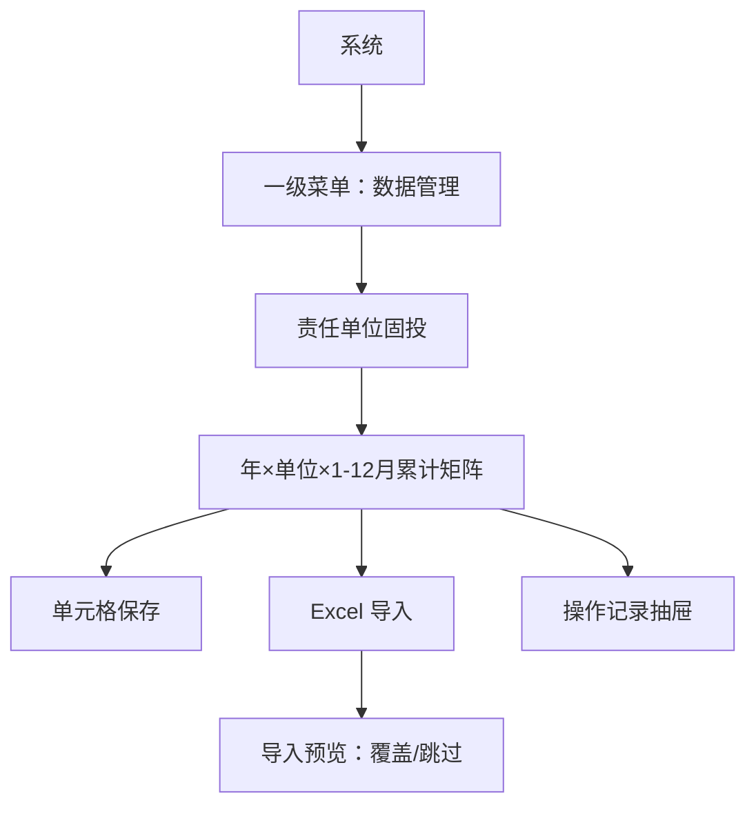
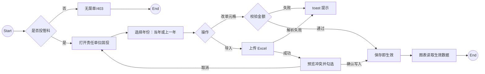

# 数据管理（责任单位固投）PRD（完整稿）

**版本**：V1.0（MVP）  
**模块**：数据管理 / 责任单位固投  
**最后更新**：2026-08-17  
**适用项目**：`project_qingpu_pc`  
**消费方**：项目概览等「按责任单位展示 1 月–当月累计完成固投」的图表

---

## 1. 背景与目标

### 1.1 背景

系统中已有若干图表按责任单位展示 **当年 1 月至当月累计完成固定资产投资（固投）**。目前该数缺少独立维护入口，无法由投管科按统计口径按年、按月、按单位录入与校正。项目侧「形象进度完成资金」是另一套口径，不能直接加总替代固投。

### 1.2 目标（MVP）

1. 新增一级菜单 **数据管理**，子页 **责任单位固投**，供 **投管科** 维护「年 × 月 × 责任单位」的累计完成固投。
2. 录入口径：**直接填写「当年 1 月至该月」的累计值**（不是当月增量）。
3. 数据为 **独立台账**，不从项目形象进度资金汇总。
4. **保存即生效**：图表读取已填累计值；未填按 0。
5. 支持 **页面逐格录入/修改** 与 **Excel 导入（预览后勾选覆盖或跳过）**。
6. 责任单位名单 **复用系统现有字典**，本模块不维护单位增删。
7. 演示环境增加角色 **投管科**；非投管科不展示本菜单、不可进入本模块。

### 1.3 非目标（本期不做）

- 导出 Excel
- 在本模块增删改责任单位 / 单位分类（街镇、政府机构、国企）
- 从项目形象进度资金自动汇总或覆盖
- 草稿、发布、审批流
- 删除单条或清空整月（只能改数）
- 维护当年与上一年以外的更早年份
- 其他数据管理子模块（仅本页）
- 与外部统计系统对接

---

## 2. 术语与定义

| 术语 | 定义 |
|---|---|
| 固投 | 固定资产投资累计完成额。本模块专指统计口径下的单位级累计完成，单位 **万元**，保留 **2 位小数** |
| 累计完成 | **当年 1 月至该月（含）** 的累计值。例如填 2026 年 8 月 = 2026-01～2026-08 合计 |
| 责任单位 | 复用系统字典 `RESPONSIBLE_UNIT_OPTIONS`，与项目库责任单位一致 |
| 生效数据 | 保存或导入确认写入后的值；图表立即使用 |
| 未填 | 该年该月该单位无记录；图表按 **0** |
| 投管科 | 本模块唯一维护角色；演示预设用户「吴芳」 |

---

## 3. 用户与使用场景

### 3.1 角色

| 角色 | 说明 | 本模块操作 |
|---|---|---|
| 投管科 | 固投台账维护人 | 查看、录入、修改、导入、查看操作记录 |
| 系统管理员 / 项目专员 / 分管领导 / 片区专员 / 市领导 / 部门一把手 | 其他角色 | **无菜单、不可进入**；图表仍消费已生效数据 |

### 3.2 典型场景

1. **按月补录**：吴芳进入责任单位固投 → 选择 2026 年 → 在 8 月列填写各单位累计完成（万元）→ 保存 → 项目概览「固定资产投资」柱图立即按该累计值展示（图表侧换算为亿元）。
2. **改历史月**：发现 7 月某单位填错 → 直接改 7 月单元格 → 保存即覆盖，图表若当前查看月为 7 月则同步变化。
3. **Excel 导入**：下载模板 → 填 年份/月份/责任单位/累计完成固投（万元）→ 上传 → 预览冲突行 → 勾选覆盖或跳过 → 确认写入。
4. **切上一年**：年份切到 2025，维护上一年 1–12 月，供同比类图表取数。

---

## 4. 信息架构与页面

### 4.0 IA 图（信息架构）

### 4.1 用户流程图（User Flow）

### 4.2 页面清单

| 编号 | 页面 | 路由建议 | 说明 |
|---|---|---|---|
| P1 | 责任单位固投（矩阵页） | `/data-management/unit-fixed-investment` | 唯一主页面 |
| P2 | 导入预览弹窗 | 挂在 P1 | 冲突勾选覆盖/跳过 |
| P3 | 操作记录抽屉 | 挂在 P1 | 只读审计 |

### 4.3 页面布局要点（可交付研发）

**P1 责任单位固投**

1. 顶部：标题「责任单位固投」+ 一句口径：「填写当年 1 月至该月的累计完成固投（万元），保存即生效」。
2. 工具条：年份（当年 / 上一年）｜下载导入模板｜导入 Excel｜操作记录。
3. 表格：
   - 左列固定：责任单位（字典全量，按字典顺序）
   - 列：1 月 … 12 月，表头可标「累计至该月」
   - 单元格：已填显示金额（千分位，2 位小数）；未填显示空（图表按 0，界面不要写成「0」以免误以为已填 0）
   - 投管科可直接编辑单元格，失焦或点「保存」写入（见决策点 D5）
   - 底部或右侧提示：不能删除，只能改数；不允许填写 **晚于当前月** 的月份（当年未来月锁定）
4. 表尾「合计」行：各月对已填单位求和（未填不计入合计公式时按 0，与图表一致）。

**P2 导入预览**

- 成功解析行数 / 失败行数 / 冲突行数
- 表格列：行号、年份、月份、责任单位、原值、新值、处理（覆盖 / 跳过）
- 冲突行默认「跳过」，可勾选「覆盖」；无原值的空缺行默认写入
- 底部：取消 / 确认写入

**P3 操作记录**

- 时间、操作人、动作（录入/修改/导入覆盖）、年份、月份、责任单位、旧值、新值

---

## 5. 数据模型（字段定义）

### 5.1 核心实体：单位固投累计（UnitFixedInvestment）

| 字段 | 类型 | 必填 | 说明 |
|---|---|---|---|
| id | string | 是 | 主键 |
| year | number | 是 | 统计年，仅允许当年或上一年 |
| month | number | 是 | 1–12 |
| unitName | string | 是 | 责任单位，必须命中字典 |
| amountWan | number | 是 | 累计完成固投，万元，≥0，最多 2 位小数 |
| updatedAt | datetime | 是 | 最后写入时间 |
| updatedBy | string | 是 | 最后写入人（演示：吴芳） |

唯一键：`(year, month, unitName)`。

未填 = 无记录，不是 amountWan=0。用户若显式填 0，则记为已填 0。

### 5.2 附属实体：导入批次（ImportBatch，可选落地）

| 字段 | 类型 | 说明 |
|---|---|---|
| id | string | 批次号 |
| fileName | string | 文件名 |
| totalRows | number | 解析成功行 |
| writtenRows | number | 实际写入行 |
| skippedRows | number | 跳过行 |
| failedRows | number | 校验失败行 |
| operator | string | 操作人 |
| createdAt | datetime | 导入时间 |

### 5.3 附属实体：操作记录（AuditLog）

| 字段 | 类型 | 说明 |
|---|---|---|
| id | string | 主键 |
| action | enum | `create` / `update` / `import_overwrite` / `import_insert` |
| year / month / unitName | — | 定位键 |
| oldAmountWan | number? | 无则空 |
| newAmountWan | number | 新值 |
| operator | string | 操作人 |
| operatedAt | datetime | 操作时间 |
| batchId | string? | 导入批次 |

### 5.4 图表消费约定

- 图表取 **查看年份 + 查看月份** 对应各单位 `amountWan`；无记录 → 0。
- 项目概览经济分析纵轴为 **亿元**：`亿元 = amountWan / 10000`，展示再按图表现有小数规则四舍五入。
- 「形象进度完成金额」仍走原项目口径，本模块不改。

---

## 6. 核心功能需求

### 6.1 列表/矩阵展示字段

| 展示项 | 说明 |
|---|---|
| 年份 | 默认当年（2026）；可选上一年（2025） |
| 责任单位 | 字典全量 |
| 1–12 月累计 | 万元，2 位小数；未来月锁定不可填 |
| 合计行 | 按列求和（未填当 0） |

### 6.2 创建/编辑/复制/删除

- **创建**：对未填单元格写入金额 → 新增记录。
- **编辑**：对已填单元格改数 → 覆盖，写审计。
- **复制**：本期不做。
- **删除**：本期不做；不可清空整月。

### 6.3 搜索/筛选/排序

- MVP：按年份切换；单位列按字典顺序，不做多选筛选。
- 单位较多时可在表头提供「定位单位」关键字过滤（推荐做，不影响写入）。

### 6.4 导入/导出

**导出**：本期不做。

**导入模板列（表头固定）**

| 列名 | 规则 |
|---|---|
| 年份 | 整数，须为当年或上一年 |
| 月份 | 1–12，且不得晚于当前月（当年） |
| 责任单位 | 必须与字典完全一致 |
| 累计完成固投（万元） | ≥0，最多 2 位小数 |

**导入规则**

1. 解析失败行（格式错、单位不在字典、未来月、年份越权）列入失败清单，不写入。
2. 与已有 `(年,月,单位)` 冲突：进入预览，默认跳过，投管科可改为覆盖。
3. 无原值：预览中默认「写入」。
4. 确认后一次性提交；部分失败不影响已确认的成功行（见决策点 D6）。

---

## 7. 状态机（表格）

### 7.1 状态枚举（单元格）

| 状态 | 含义 |
|---|---|
| 未填 | 无记录；图表按 0；界面为空 |
| 已填 | 有记录（含显式 0） |
| 锁定 | 当年晚于当前月的列，不可编辑、不可导入 |

导入预览行状态：`待写入` / `待覆盖` / `跳过` / `校验失败`。

### 7.2 状态转移与动作规则（含失败提示）

| 当前状态 | 动作 | 目标状态 | 前置条件 | 失败分支 | 失败提示 | 幂等/回滚 |
|---|---|---|---|---|---|---|
| 未填 | 录入保存 | 已填 | 投管科；年∈{当年,上年}；月合法；金额≥0 且 2 位小数；单位在字典 | 校验失败 | 「请填写不小于 0 的金额，最多 2 位小数」 | 未写入则仍未填 |
| 已填 | 修改保存 | 已填 | 同上 | 校验失败 | 同上 | 失败保留旧值 |
| 未填/已填 | 导入写入/覆盖 | 已填 | 预览已确认；冲突行须勾选覆盖 | 行校验失败 | 「第 N 行：责任单位不在字典 / 月份不可填」 | 失败行不写；成功行保留 |
| 已填 | 导入跳过 | 已填 | — | — | — | 不改数 |
| 锁定 | 任何写入 | 锁定 | — | 拒绝 | 「不可填写晚于当前月的数据」 | 不写 |
| 任意 | 删除 | — | 本期无此动作 | — | — | — |

无草稿/发布/审批。无删除转移。

---

## 8. 权限与安全

### 8.1 权限点（最小集）

| 权限点 | 投管科 | 其他角色 |
|---|---|---|
| 菜单可见 / 进入模块 | ● | ○ |
| 查看矩阵 | ● | ○ |
| 录入/修改 | ● | ○ |
| 导入 | ● | ○ |
| 查看操作记录 | ● | ○ |
| 消费图表数据 | 图表页按原页面权限 | 图表页按原页面权限 |

路由守卫：非投管科访问 `/data-management/**` → 无权限页。

演示：角色切换增加「投管科」（吴芳 / 区发改委）。

### 8.2 风险操作策略

| 操作 | 策略 |
|---|---|
| 改历史月 | 允许；保存即生效；写审计（旧值/新值） |
| 导入覆盖 | 预览二次确认；默认跳过冲突 |
| 删除 | 不做 |
| 并发 | 后写覆盖先写；提示「已保存」即可（MVP 不做乐观锁） |
| 幂等 | 同一值重复保存不新增重复行，可记一条 update 或忽略（推荐值不变则不写审计） |

---

## 9. 异常与边界（必须覆盖）

### 9.1 空态

- 新年份尚无任何已填：矩阵全空，合计 0；提示「尚未填报，图表将按 0 展示」。
- 操作记录为空：「暂无操作记录」。
- 导入预览 0 条有效行：「没有可写入的数据，请检查模板」。

### 9.2 加载态

- 矩阵、导入解析、确认写入使用 Spin / 按钮 loading，防重复提交。

### 9.3 错误态

| 场景 | 处理 |
|---|---|
| 非投管科进页 | 403 / 无权限 |
| 模板列名不对 | 「请使用系统下载的模板」 |
| 单位名称多空格/别名 | 按失败行，不模糊匹配 |
| 网络/5xx | toast「保存失败，请重试」，单元格回滚到旧值 |
| 金额负数、过多小数 | 拦截不保存 |

### 9.4 长文本/多标签/大量数据/并发点击

- 单位名按字典，无自由长文本。
- 字典单位数增长时表格左右滚动，左列冻结。
- 保存与导入确认按钮 loading，禁止连点。
- 单次导入建议不超过 2000 行；超出提示拆分文件。

**累计单调（弱规则）**：不强制 8 月累计 ≥ 7 月累计。若 8 月 < 7 月，保存成功，仅黄色提示「该月累计小于上月，请确认是否填报有误」。

---

## 10. 埋点与指标（可选）

本期不做产品埋点。保留操作记录即可统计：月度填报覆盖率（已填单位数 / 字典单位数）。

---

## 11. 验收标准（DoD）

### 11.1 功能 DoD

- [ ] 一级菜单「数据管理」仅投管科可见，子页为责任单位固投
- [ ] 可切换当年、上一年；展示字典内全部单位 × 1–12 月
- [ ] 单元格填写的是 1 月至该月累计（万元，2 位小数），保存即生效
- [ ] 未填图表按 0；显式 0 为已填
- [ ] 当年未来月锁定
- [ ] 不能删除，只能改数
- [ ] Excel 导入：模板、失败行提示、冲突预览默认跳过可改覆盖
- [ ] 操作记录可查旧值新值
- [ ] 其他角色无菜单且路由不可进
- [ ] 项目概览固定资产投资柱图读取本台账（亿元 = 万元/10000），不与形象进度资金混用

### 11.2 质量 DoD

- [ ] 空/加载/错误态可用
- [ ] 非法金额、非法单位、越权年份/未来月有明确失败提示
- [ ] 导入确认与保存防重复提交
- [ ] 非投管科无法调用写入接口（演示以角色切换+前端守卫为准，生产需后端校验）

---

## 12. 验收用例清单（测试可直接用）

### 12.1 列表与展示

| 编号 | 步骤 | 期望 |
|---|---|---|
| L-S | 投管科进入模块，年份默认当年 | 见全部字典单位，1–12 月列；未来月锁定 |
| L-F | 无任何已填 | 单元格空，合计 0，有空态说明 |
| L-P | 非投管科登录 | 无「数据管理」菜单 |

### 12.2 搜索

| 编号 | 步骤 | 期望 |
|---|---|---|
| S-S | 定位关键字「建管」 | 仅过滤展示含该字单位，不改数据 |
| S-F | 关键字无匹配 | 表格空态「无匹配单位」 |
| S-P | 非投管科 | 无法使用本页搜索 |

### 12.3 筛选与排序

| 编号 | 步骤 | 期望 |
|---|---|---|
| F-S | 切换上一年 | 加载上一年矩阵，与当年数据隔离 |
| F-F | 试图选择前年 | 无该选项 |
| F-P | 其他角色切年 | 进不了页 |

### 12.4 新建/编辑

| 编号 | 步骤 | 期望 |
|---|---|---|
| E-S | 未填单元格输入 1234.56 保存 | 变为已填；图表该单位当月为 0.1235 亿元量级（/10000） |
| E-F | 输入 -1 或 1.234 | 不保存，提示金额规则 |
| E-P | 伪造请求非投管科保存 | 拒绝 |
| E-H | 修改 7 月历史值 | 覆盖成功，审计有旧值新值 |
| E-L | 编辑 9 月（当前为 8 月） | 不可编辑 |

### 12.5 导入

| 编号 | 步骤 | 期望 |
|---|---|---|
| I-S | 导入空缺单位合法行 | 预览默认写入，确认后已填 |
| I-F | 单位写成别名 | 失败行提示不在字典 |
| I-C | 已有值冲突 | 默认跳过；勾选覆盖后旧值被替换 |
| I-P | 非投管科导入 | 无入口 |
| I-M | 导入当年未来月 | 失败，不写入 |

### 12.6 发布/删除

| 编号 | 步骤 | 期望 |
|---|---|---|
| D-N | 寻找删除按钮 | 无删除、无清空整月 |
| D-N2 | 无发布按钮 | 保存即生效，无草稿 |

### 12.7 权限矩阵

| 编号 | 步骤 | 期望 |
|---|---|---|
| P-S | 切换投管科 | 可见数据管理并可保存 |
| P-F | 切换项目专员访问路由 | 无权限 |
| P-C | 专员打开项目概览 | 仍能看到图表（用已生效固投） |

### 12.8 错误与恢复

| 编号 | 步骤 | 期望 |
|---|---|---|
| R-S | 保存时断网后重试 | 成功则生效，失败回滚显示 |
| R-F | 错误模板上传 | 提示使用系统模板 |
| R-5 | 写入 5xx | toast 失败，数据不变 |

### 12.9 边界

| 编号 | 步骤 | 期望 |
|---|---|---|
| B-0 | 显式填写 0 | 已填 0，与未填空单元格可区分 |
| B-M | 8 月累计 < 7 月 | 能保存，弱提示 |
| B-C | 连续点击保存 | 只提交一次 |
| B-I | 导入 >2000 行 | 提示拆分 |

---

## 13. 决策点（需要拍板 + 默认建议）

| 编号 | 问题 | 已确认 / 推荐默认 | 影响 |
|---|---|---|---|
| — | 填报口径 | ✅ 直接填 1 月–该月累计 | 不做月增量加总 |
| — | 与项目资金关系 | ✅ 独立台账 | 图表固投不走形象进度 |
| — | 单位名单 | ✅ 复用现有字典，本模块不维护 | 字典过短需另改公共字典 |
| — | 生效 | ✅ 保存即生效，历史月可改 | 无审批 |
| — | 权限 | ✅ 仅投管科维护；他人无菜单 | 演示加投管科角色 |
| — | 录入 | ✅ 页面编辑 + Excel 导入；万元；不做导出 | — |
| — | 年份 | ✅ 当年 + 上一年 | — |
| — | 导入冲突 | ✅ 预览勾选覆盖或跳过 | — |
| — | 未填 | ✅ 图表按 0 | 界面显示空而非 0 |
| — | 删除 | ✅ 不能删只能改 | — |
| — | 精度 | ✅ 2 位小数万元 | — |
| — | 入口 | ✅ 一级「数据管理」/ 子页责任单位固投 | — |
| D1 | 当年未来月能否填 | **推荐：锁定不可填** | 避免预填未发生累计 |
| D2 | 8 月累计 < 7 月 | **推荐：弱提示不阻断** | 允许纠错 |
| D3 | 图表亿元换算 | **推荐：万元/10000** | 对齐项目概览纵轴 |
| D4 | 现有字典仅约 8 个单位、图表曾按约 30 个单位演示 | **推荐：本期严格复用字典；扩名单走公共字典改造，不在本模块做** | 图表单位数与字典一致 |
| D5 | 单元格保存时机 | **推荐：失焦自动保存 + toast「已保存」** | 少一次点保存 |
| D6 | 导入部分行失败 | **推荐：成功行写入，失败行下载/展示清单** | 避免整表全失败 |
| D7 | 是否做操作记录 | **推荐：做（本期）** | 历史月可改，必须可追溯 |
| D8 | 系统管理员要不要进本模块 | **推荐：按你的选择，管理员也不进；仅投管科** | 与「仅投管科」一致 |

---

## 需求匹配度自检

**覆盖度检查**（对照用户原始需求）

| 原始需求点 | PRD 位置 | 状态 |
|---|---|---|
| 加数据管理模块 | §4 一级菜单 | ✅ |
| 图表展示各责任单位 1–当月累计固投 | §5.4 图表消费 | ✅ |
| 投管科维护 | §3.1 / §8 | ✅ |
| 每年每月每个单位 | §5.1；年份限制为当年+上年 | ✅（按澄清收窄） |
| 提问后确认的口径/导入/权限等 | §1.2、§6.4、§13 | ✅ |

**逻辑一致性**

- 状态仅未填/已填/锁定，无删除、无发布，无死状态。
- 权限点与「仅投管科」一致；图表消费不依赖进入本模块。
- 页面清单 P1–P3 均在 §4.3、§6、§9、§11、§12 出现，无残留页。

**完整性**

- 数据模型字段表：✅
- 状态机表格：✅
- 验收用例（含失败/权限）：✅
- 决策点列表：✅

**结论**：8/8 个已澄清需求点已覆盖；D1–D8 为推荐默认，可按此进入设计与研发。
