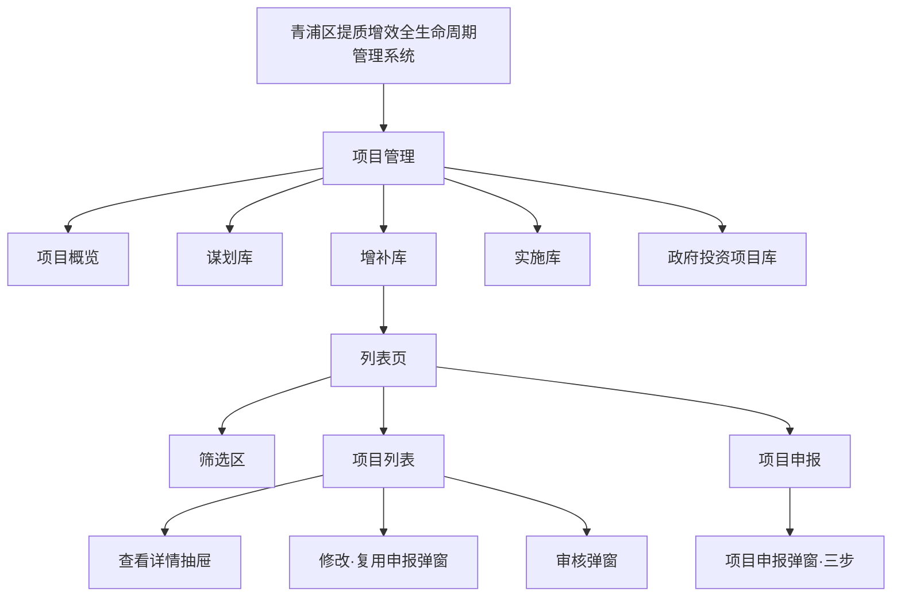
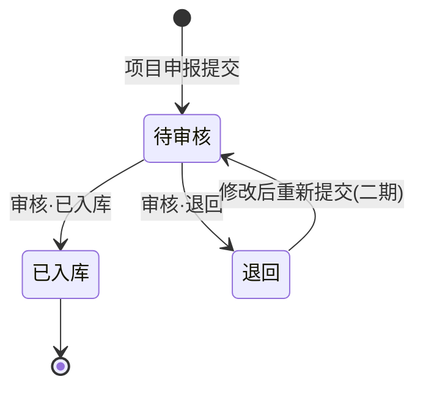

# 青浦区提质增效全生命周期管理系统 — 项目管理 PRD

**版本**：V1.0（MVP）  
**模块**：项目管理（增补库为主）  
**最后更新**：2026-06-22  
**代码基线**：`project_qingpu_pc`

---

## 1. 背景与目标

### 1.1 背景

青浦区项目全生命周期管理需对谋划、增补、实施、政府投资等不同阶段的项目进行分类管理。其中 **增补库** 承担「新建项目申报 → 审核入库」的核心链路，是项目进入体系的首个正式入口。

### 1.2 目标（MVP）

1. 提供 **增补库** 完整能力：筛选查询、项目列表、项目申报、修改、审核、详情查看。
2. 建立 **项目四库** 导航骨架：项目概览、谋划库、增补库、实施库、政府投资项目库。
3. 统一 **项目数据模型** 与 **状态流转**（待审核 / 已入库 / 退回）。
4. 支持 **按项目属性** 动态展示申报表单中的时间字段。

### 1.3 非目标（本期不做）

- 与外部审批系统/OA 对接
- 审核通过后自动流转至实施库（预留接口）
- 权限细粒度控制（角色/街镇数据隔离）
- 批量导入/导出 Excel
- 移动端适配
- 附件上传（土地证、批复文件等）

---

## 2. 术语与定义

| 术语 | 定义 |
|---|---|
| 增补库 | 用户新建申报项目的管理库，审核通过后项目状态为「已入库」 |
| 谋划库 | 处于前期谋划阶段的项目库，可转入增补库 |
| 实施库 | 已开工/在建项目的跟踪库 |
| 政府投资项目库 | 政府投资类项目的专项库 |
| 项目申报 | 通过三步表单新建或修改项目信息 |
| 项目属性 | 社会投资 / 政府投资 / 其他，决定部分时间字段是否展示 |
| 项目类别 | 房地产 / 工业 / 其他（与项目类型枚举一致） |
| 项目状态 | 待审核、已入库、退回 |

---

## 3. 用户与使用场景

### 3.1 角色（MVP 简化）

| 角色 | 说明 | 主要操作 |
|---|---|---|
| 管理员 | 系统管理与审核 | 项目申报、修改、审核、查看详情 |
| 业务人员 | 项目申报与维护 | 项目申报、修改、查看详情 |

> MVP 未做登录与权限隔离，默认以管理员身份操作。

### 3.2 典型场景

1. **申报新项目**：进入增补库 → 点击「项目申报」→ 分三步填写 → 提交后状态为「待审核」。
2. **修改申报**：列表点击「修改」→ 打开申报弹窗（编辑模式）→ 保存。
3. **审核项目**：对待审核项目点击「审核」→ 选择「已入库」或「退回」→ 填写审核意见（选填）→ 确认。
4. **查询项目**：使用筛选区组合条件查询 → 查看列表 → 点击「查看详情」。
5. **谋划转增补**：在谋划库点击「转增补库」，项目 `poolStage` 变更为增补库。

---

## 4. 信息架构与页面

### 4.0 IA 图



### 4.1 页面清单

| 页面名称 | 路由 | 类型 | 说明 |
|---|---|---|---|
| 项目概览 | `/project-management/overview` | 统计页 | 项目总数、待审核、实施中、总投资、各库分布 |
| 谋划库 | `/project-management/planning-pool` | 列表页 | 谋划阶段项目，支持转增补库 |
| **增补库** | `/project-management/supplement-pool` | 列表页 | **本期核心页面** |
| 实施库 | `/project-management/implementation-pool` | 列表页 | 在建项目，含投资完成率 |
| 政府投资项目库 | `/project-management/gov-investment-pool` | 列表页 | 政府投资项目专项列表 |
| 项目申报 | — | 弹窗（三步） | 新建/修改项目 |
| 项目详情 | — | 抽屉 | 只读查看全部字段 |
| 项目审核 | — | 弹窗 | 待审核项目审核 |

### 4.2 全局布局

- **左侧 Sider**：项目管理分组菜单，支持收起/展开
- **顶栏**：系统标题 + 当前页面面包屑 + 用户信息
- **内容区**：Page Header（标题 + 描述）→ 筛选区 → 列表区

---

## 5. 增补库 — 功能详述

### 5.1 筛选区

筛选区位于列表上方，按钮顺序：**展开 → 查询 → 重置**。

| 筛选项 | 控件 | 说明 |
|---|---|---|
| 关键字 | 输入框 | 匹配项目名称、项目代码 |
| 项目类型 | 下拉 | 房地产 / 工业 / 其他 |
| 投资额 | 下拉 | 1亿元以下 / 1-5亿元 / 5-10亿元 / 10亿元以上 |
| 所属街镇 | 下拉 | 青浦区各街镇 |
| 责任单位 | 下拉 | 区级委办局 |
| 项目状态 | 下拉 | 待审核 / 已入库 / 退回 |

### 5.2 列表区

**工具栏**：筛选区下方提供「项目申报」主按钮。

**表格列**：

| 列名 | 说明 | 展示规则 |
|---|---|---|
| 项目名称 | 文本 | 超长 ellipsis |
| 项目代码 | 文本 | 系统生成 |
| 项目类型 | 枚举 | 房地产 / 工业 / 其他 |
| 项目属地 | 文本 | 街镇 |
| 项目性质 | 枚举 | 新建 / 扩建 / 改建 / 迁建 |
| 责任单位 | 数组 | 首个单位 Tag + `+N`，悬停 Tooltip 展示全部 |
| 总投资（亿元） | 数值 | 保留 2 位小数 |
| 项目状态 | 枚举 | Tag：待审核(蓝) / 已入库(绿) / 退回(红) |
| 操作 | — | 查看详情 / 修改 / 审核 |

**列表交互**：

- 不展示行首勾选框（`:selection="false"`）
- 分页：默认每页 10 条
- 空态：引导点击「项目申报」

**操作规则**：

| 操作 | 条件 | 行为 |
|---|---|---|
| 查看详情 | 无 | 打开详情抽屉 |
| 修改 | 无 | 打开申报弹窗（编辑模式） |
| 审核 | 仅「待审核」 | 打开审核弹窗；其他状态按钮禁用 |

### 5.3 项目申报弹窗（三步）

弹窗宽度 800px，分三个步骤，底部按钮：**取消 / 上一步 / 下一步 / 提交申报**。

#### 步骤一：基本信息

| 字段 | 类型 | 必填 |
|---|---|---|
| 项目名称 | 文本 | 是 |
| 项目简称 | 文本 | 否 |
| 项目属地 | 单选下拉 | 是 |
| 总投资（亿元） | 数值，2 位小数 | 是 |
| 责任单位 | 多选下拉 | 是 |

#### 步骤二：建设信息

**业主信息**

| 字段 | 类型 | 必填 |
|---|---|---|
| 项目单位名称 | 文本 | 是 |
| 项目属性 | 下拉：社会投资 / 政府投资 / 其他 | 是 |
| 项目类别 | 下拉：房地产 / 工业 / 其他 | 是 |

**建筑信息**

| 字段 | 类型 | 必填 |
|---|---|---|
| 建设地点 | 文本 | 是 |
| 详细建设地址 | 文本 | 是 |
| 建设性质 | 下拉：新建 / 扩建 / 改建 / 迁建 | 是 |
| 建设进度 | 文本 | 否 |
| 建设规模及内容 | 多行文本 | 是 |
| 拟开工时间 | 日期 | 否 |
| 拟建成时间 | 日期 | 否 |
| 是否需领取施工许可证 | 布尔 | 是（表单字段，非勾选框样式可二期优化为下拉） |

#### 步骤三：补充信息

**土地信息**

| 字段 | 类型 | 必填 |
|---|---|---|
| 本企业已有土地的土地证书编号 | 文本 | 否 |

**其余**

| 字段 | 类型 | 必填 | 显示条件 |
|---|---|---|---|
| 子项目 | 多选搜索下拉 | 否 | 始终 |
| 形成方案完成时间 | 日期 | 条件必填 | 项目属性 = 社会投资 |
| 规划落地完成时间 | 日期 | 条件必填 | 项目属性 = 政府投资 或 其他 |
| 项建书批复完成时间 | 日期 | 条件必填 | 项目属性 = 政府投资 或 其他 |

**条件字段规则**：

1. 默认三个时间字段均 **不展示**。
2. 选择「社会投资」→ 仅展示「形成方案完成时间」。
3. 选择「政府投资」或「其他」→ 展示「规划落地完成时间」「项建书批复完成时间」。
4. 切换项目属性时，清空三个时间字段已填值。
5. 每步仅校验当前步骤字段，通过后进入下一步。

**提交规则**：

- 新建：提交后生成项目代码，状态为「待审核」，`poolStage = supplement`。
- 编辑：更新已有项目，不改变项目代码。

### 5.4 项目详情抽屉

只读展示，分组：

- 基本信息（含所属库、投资完成率若有）
- 业主信息
- 建筑信息
- 土地及其他（含条件时间字段、审核意见）

### 5.5 项目审核弹窗

| 字段 | 类型 | 必填 |
|---|---|---|
| 审核结果 | 单选：已入库 / 退回 | 是 |
| 审核意见 | 多行文本 | 否 |

**状态流转**：



> MVP：退回后可通过「修改」编辑，但重新提交不会自动变回待审核（二期完善）。

---

## 6. 其他库（MVP 范围）

### 6.1 项目概览

- 统计卡片：项目总数、待审核数、实施中数、总投资（亿元）
- 各库项目分布（可点击跳转对应库）
- 街镇项目 TOP6

### 6.2 谋划库

- 筛选维度同增补库（无项目状态操作列差异）
- 列表无「项目申报」，操作：查看详情、转增补库

### 6.3 实施库

- 筛选 + 列表
- 额外列：建设进度、投资完成率（Progress）
- 操作：查看详情

### 6.4 政府投资项目库

- 筛选 + 列表
- 额外列：投资完成率
- 责任单位展示规则同增补库

---

## 7. 数据模型

### 7.1 项目（Project）

| 字段 | 类型 | 必填 | 说明 |
|---|---|---|---|
| id | string | 是 | 主键 |
| projectCode | string | 是 | 项目代码，系统自动生成 |
| projectName | string | 是 | 项目名称 |
| projectAbbr | string | 否 | 项目简称 |
| projectType | enum | 是 | real_estate / industry / other |
| projectLocation | string | 是 | 项目属地（街镇） |
| projectNature | enum | 是 | 建设性质，同 constructionNature |
| poolStage | enum | 是 | planning / supplement / implementation / gov |
| responsibleUnits | string[] | 是 | 责任单位 |
| totalInvestment | number | 是 | 总投资（亿元） |
| status | enum | 是 | pending / stored / returned |
| unitName | string | 是 | 项目单位名称 |
| projectAttribute | enum | 是 | social / government / other |
| projectCategory | enum | 是 | real_estate / industry / other |
| constructionSite | string | 是 | 建设地点 |
| constructionAddress | string | 是 | 详细建设地址 |
| constructionNature | enum | 是 | new / expand / rebuild / relocate |
| constructionScale | string | 是 | 建设规模及内容 |
| constructionProgress | string | 否 | 建设进度 |
| proposedStartDate | date | 否 | 拟开工时间 |
| proposedEndDate | date | 否 | 拟建成时间 |
| needConstructionPermit | boolean | 是 | 是否需领取施工许可证 |
| landCertificateNo | string | 否 | 土地证书编号 |
| subProjects | string[] | 否 | 子项目 ID 列表 |
| schemeCompleteDate | date | 条件 | 形成方案完成时间 |
| planningCompleteDate | date | 条件 | 规划落地完成时间 |
| proposalApprovalDate | date | 条件 | 项建书批复完成时间 |
| progressPercent | number | 否 | 投资完成率（实施库等） |
| auditRemark | string | 否 | 审核意见 |
| createdAt | date | 是 | 创建日期 |

### 7.2 枚举对照

**项目类型 / 项目类别**

| 值 | 展示 |
|---|---|
| real_estate | 房地产 |
| industry | 工业 |
| other | 其他 |

**项目属性**

| 值 | 展示 |
|---|---|
| social | 社会投资 |
| government | 政府投资 |
| other | 其他 |

**项目状态**

| 值 | 展示 | Tag 色 |
|---|---|---|
| pending | 待审核 | processing |
| stored | 已入库 | success |
| returned | 退回 | error |

**建设性质**

| 值 | 展示 |
|---|---|
| new | 新建 |
| expand | 扩建 |
| rebuild | 改建 |
| relocate | 迁建 |

---

## 8. 接口（MVP Mock）

Base URL：`/api/v1`

| 方法 | 路径 | 说明 |
|---|---|---|
| GET | `/projects?poolStage=supplement&...` | 项目列表（含筛选） |
| GET | `/projects/:id` | 项目详情 |
| POST | `/projects` | 新建申报 |
| PUT | `/projects/:id` | 修改项目 |
| POST | `/projects/:id/audit` | 审核 `{ approved, remark? }` |
| POST | `/projects/:id/transfer` | 转库 `{ poolStage }` |
| GET | `/overview/stats` | 概览统计 |

响应格式：

```json
{ "code": 0, "message": "ok", "data": {} }
```

---

## 9. 验收标准（增补库）

| 编号 | 场景 | 预期 |
|---|---|---|
| AC-SUP-01 | 打开增补库 | 展示筛选区 + 列表 + 项目申报按钮 |
| AC-SUP-02 | 筛选关键字 | 按名称/代码过滤列表 |
| AC-SUP-03 | 新建申报·三步 | 每步校验通过后进入下一步 |
| AC-SUP-04 | 社会投资 | 第三步仅展示形成方案完成时间且必填 |
| AC-SUP-05 | 政府投资/其他 | 第三步展示规划落地、项建书批复时间且必填 |
| AC-SUP-06 | 提交申报 | 列表新增记录，状态「待审核」 |
| AC-SUP-07 | 审核·已入库 | 状态变为「已入库」 |
| AC-SUP-08 | 审核·退回 | 状态变为「退回」，可填审核意见 |
| AC-SUP-09 | 非待审核点审核 | 按钮禁用或提示不可审核 |
| AC-SUP-10 | 责任单位多个 | 首 Tag + +N，悬停看全部 |
| AC-SUP-11 | 列表 | 无行首勾选框 |

---

## 10. 设计规范

- 主色：`#134bea`
- 布局：左侧 Sider 208px，可收起至 64px
- 弹窗宽度：申报 800px，审核 480px，详情抽屉 560px
- 筛选按钮顺序：展开 → 查询 → 重置
- 组件：Ant Design Vue + das-component-vue（DasSearchBar、DasTable）

---

## 11. 二期规划

1. 对接真实后端与统一用户权限
2. 审核退回后重新提交自动回到「待审核」
3. 已入库项目自动/手动转入实施库
4. 附件上传与批复文件管理
5. 批量操作与 Excel 导入导出
6. 完整 PRD 覆盖：审核管理、领导交办、难题协调等模块

---

## 附录：代码映射

| PRD 页面/组件 | 代码路径 |
|---|---|
| 增补库列表 | `src/views/project-management/supplement-pool/index.vue` |
| 项目申报弹窗 | `src/views/project-management/supplement-pool/components/ProjectDeclareModal.vue` |
| 项目详情 | `src/views/project-management/supplement-pool/components/ProjectDetailDrawer.vue` |
| 项目审核 | `src/views/project-management/supplement-pool/components/ProjectAuditModal.vue` |
| 责任单位展示 | `src/components/ResponsibleUnitsCell.vue` |
| 类型与枚举 | `src/types/supplement-pool.ts` |
| Mock API | `server/src/store/projects.js` |
